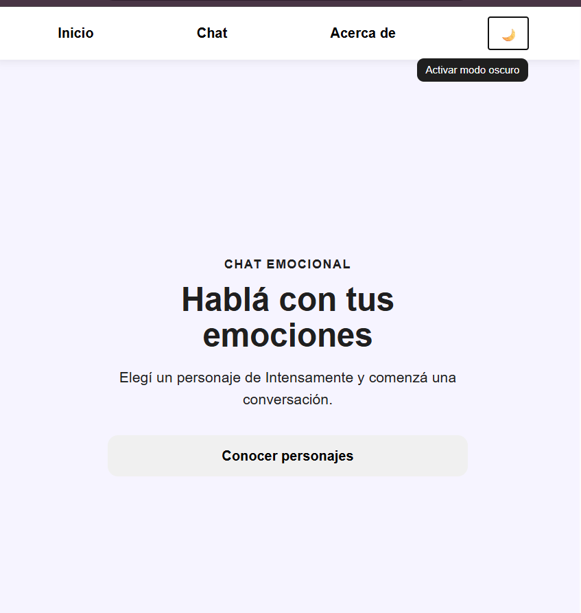
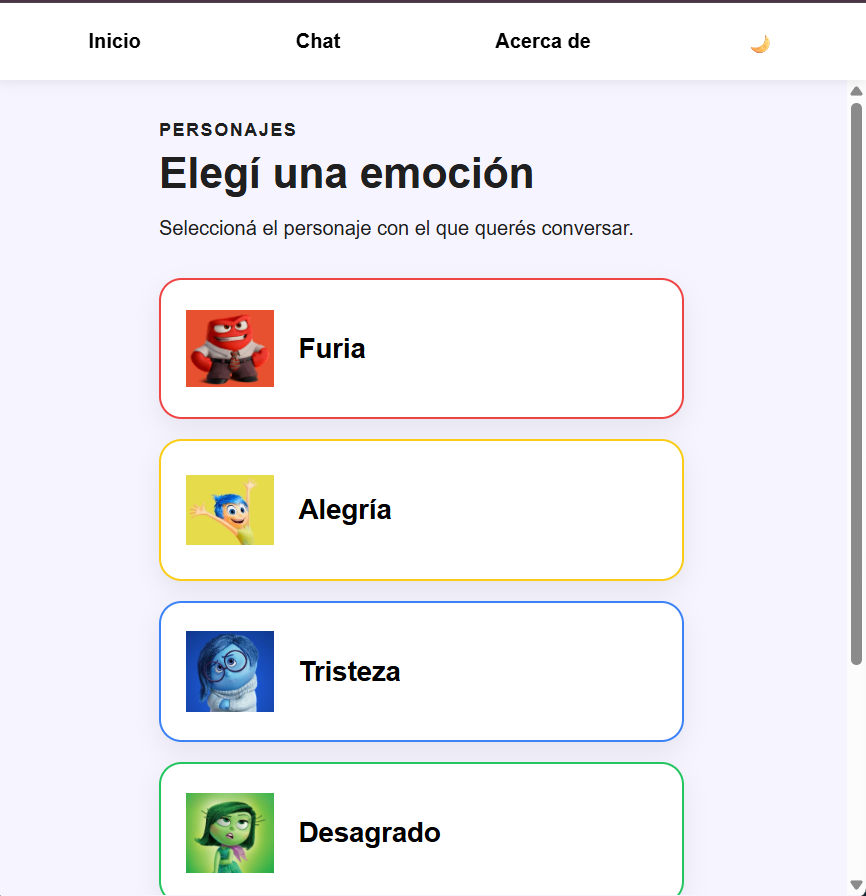
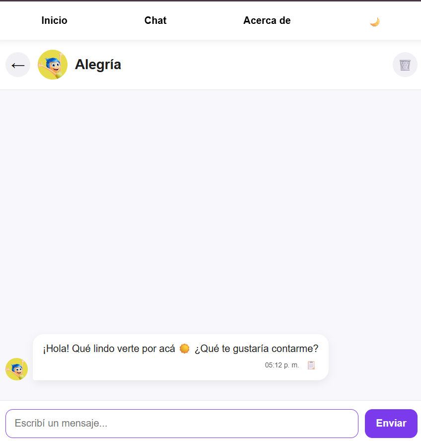
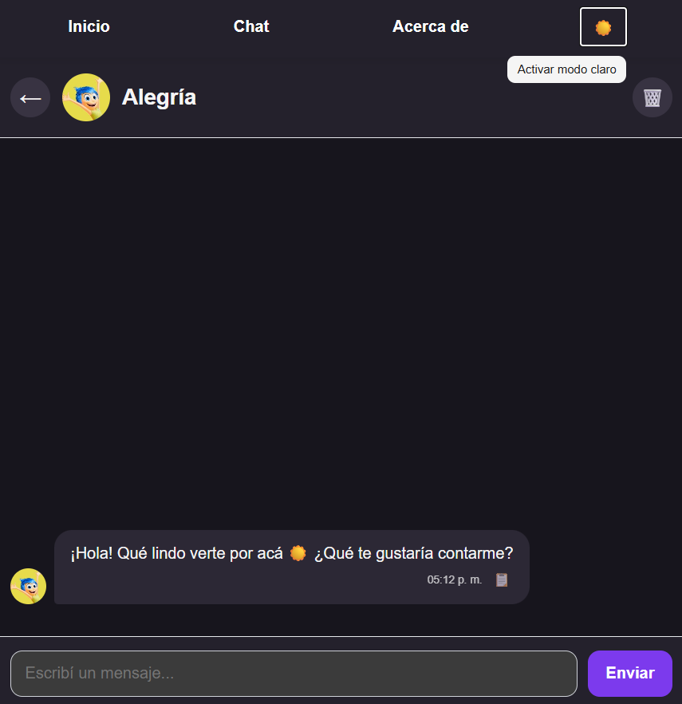

# Intensamente Chat

Aplicación web desarrollada como Proyecto Integrador del Módulo 3.

## Descripción

**Intensamente Chat** es una Single Page Application (SPA) desarrollada con JavaScript, HTML y CSS que permite mantener conversaciones con los personajes de la película *Intensamente* mediante inteligencia artificial.

La aplicación utiliza la API de Google Gemini para generar respuestas acordes a la personalidad de cada personaje. Cada conversación mantiene un historial independiente que se guarda en el navegador mediante **LocalStorage**, permitiendo continuar las conversaciones incluso después de recargar la página.

La comunicación con Gemini se realiza a través de una **Vercel Serverless Function**, evitando exponer la clave de la API en el cliente y mejorando la seguridad de la aplicación.

---

## Capturas de la aplicación

### Inicio



### Selección de personajes



### Chat



### Modo oscuro



---

## Tecnologías utilizadas

| Área | Tecnología |
|------|------------|
| Frontend | HTML5, CSS3 y JavaScript |
| Desarrollo | Vite |
| Inteligencia Artificial | Google Gemini |
| Backend | Vercel Serverless Functions |
| Persistencia | LocalStorage |
| Testing | Vitest |
| Deploy | Vercel |

---

## Funcionalidades

- Navegación mediante SPA.
- Rutas con History API.
- URL independiente para cada personaje.
- Conversaciones con inteligencia artificial.
- Historial independiente por personaje.
- Persistencia mediante LocalStorage.
- Modo claro / oscuro.
- Diseño responsive.
- Eliminación de historial con confirmación.
- Indicador de escritura mientras el personaje responde.

---

## Instalación

Clonar el repositorio:

```bash
git clone https://github.com/naylapereira/ProyectoM3_NaylaPereira-.git
```

Ingresar al proyecto:

```bash
cd ProyectoM3_NaylaPereira-
```

Instalar dependencias:

```bash
npm install
```

Crear un archivo `.env` con la siguiente variable:

```env
GEMINI_API_KEY=TU_API_KEY
```

---

## Ejecutar en desarrollo

Para iniciar el proyecto:

```bash
npx vercel dev
```

Luego abrir:

```
http://localhost:3000
```

---

## Ejecutar los tests

```bash
npm test
```

---

## Deploy

Aplicación desplegada en Vercel.

**Producción:**

```
https://pi-m3-black.vercel.app
```

---

## Estructura del proyecto

```
ProyectoM3_NaylaPereira-
├── api/
│   └── chat.js
├── docs/
│   └── images/
├── public/
│   └── characters/
├── src/
│   ├── components/
│   ├── handlers/
│   ├── services/
│   ├── styles/
│   ├── utils/
│   ├── views/
│   ├── app.js
│   ├── chat.js
│   └── utils.js
├── tests/
│   ├── app.test.js
│   └── utils.test.js
├── .env.example
├── index.html
├── package.json
├── README.md
└── vercel.json
```

---

## Tests implementados

Se realizaron pruebas unitarias utilizando **Vitest**.

Entre ellas:

- Obtención de la hora actual.
- Obtención del nombre del personaje.
- Mensajes de bienvenida.
- Simulación de `fetch` para las respuestas de la API.
- Manejo de errores de la API.

---

# Documentación del uso de IA

Durante el desarrollo se utilizó inteligencia artificial como herramienta de asistencia para resolver dudas técnicas y mejorar algunas funcionalidades de la aplicación.

## Pregunta y respuesta 1


---

## Pregunta y respuesta 2


---

## Autor

Nayla Pereira

Proyecto Integrador - Módulo 3