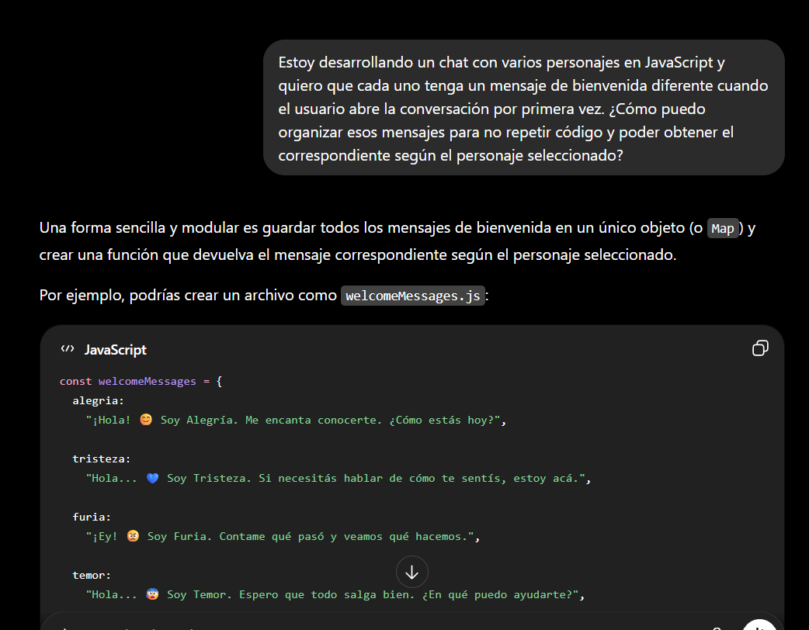
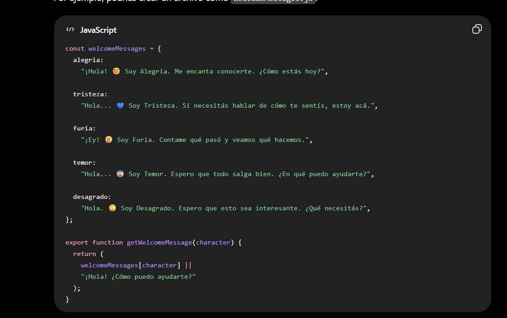
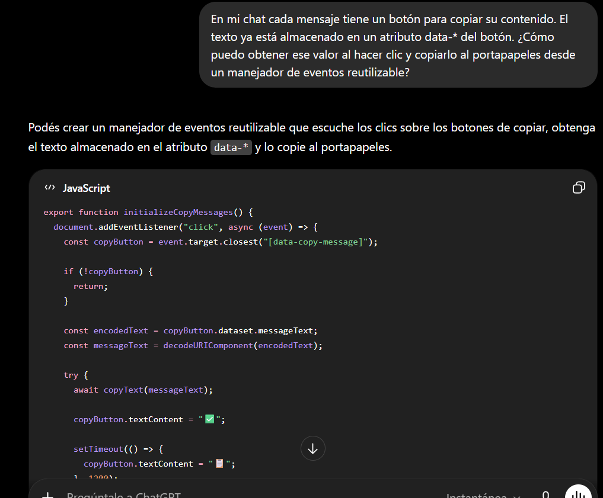
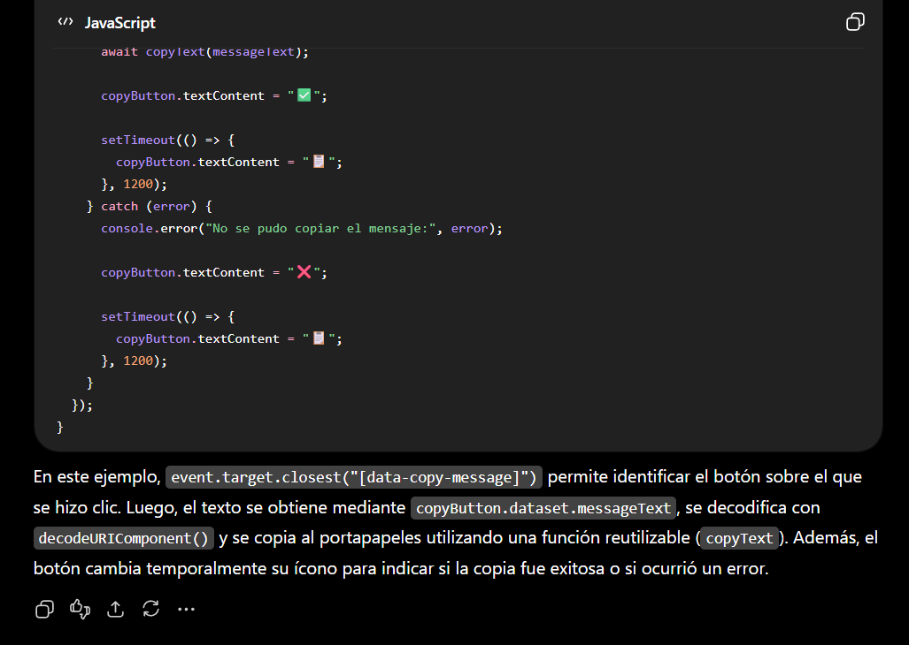

# Intensamente Chat

Aplicación web desarrollada como Proyecto Integrador del Módulo 3.

La aplicación permite conversar con distintos personajes de la película **Intensamente** utilizando la API de Google Gemini. Cada personaje mantiene su propia personalidad y conserva el historial de conversación de forma independiente.

---

## Tecnologías utilizadas

- HTML5
- CSS3
- JavaScript (ES Modules)
- Google Gemini API
- Vercel Serverless Functions
- Vite
- Vitest

---

## Funcionalidades

- Navegación mediante SPA.
- Rutas con History API.
- URL independiente para cada personaje.
- Conversaciones con inteligencia artificial.
- Historial independiente por personaje.
- Persistencia mediante LocalStorage.
- Modo claro / oscuro.
- Diseño responsive.
- Eliminación de historial con confirmación.
- Indicador de escritura mientras el personaje responde.

---

## Instalación

Clonar el repositorio:

```bash
git clone https://github.com/naylapereira/ProyectoM3_NaylaPereira-.git
```

Ingresar al proyecto:

```bash
cd ProyectoM3_NaylaPereira-
```

Instalar dependencias:

```bash
npm install
```

Crear un archivo `.env` con la siguiente variable:

```env
GEMINI_API_KEY=TU_API_KEY
```

---

## Ejecutar en desarrollo

Para iniciar el proyecto:

```bash
npx vercel dev
```

Luego abrir:

```
http://localhost:3000
```

---

## Ejecutar los tests

```bash
npm test
```

---

## Deploy

Aplicación desplegada en Vercel.

**Producción:**

```
https://pi-m3-black.vercel.app
```

---

## Estructura del proyecto

```
ProyectoM3_NaylaPereira-
│
├── api
│   └── chat.js
│
├── src
│   ├── assets
│   ├── components
│   ├── handlers
│   ├── services
│   ├── styles
│   ├── utils
│   ├── views
│   ├── app.js
│   ├── chat.js
│   └── utils.js
│
├── tests
│   ├── app.test.js
│   └── utils.test.js
│
├── index.html
├── package.json
├── package-lock.json
├── .env.example
└── README.md
```

---

## Tests implementados

Se realizaron pruebas unitarias utilizando **Vitest**.

Entre ellas:

- Obtención de la hora actual.
- Obtención del nombre del personaje.
- Mensajes de bienvenida.
- Simulación de `fetch` para las respuestas de la API.
- Manejo de errores de la API.

---

# Documentación del uso de IA

Durante el desarrollo se utilizó inteligencia artificial como herramienta de asistencia para resolver dudas técnicas y mejorar algunas funcionalidades de la aplicación.

## Pregunta y respuesta 1





---

## Pregunta y respuesta 2





---

## Autor

Nayla Pereira

Proyecto Integrador - Módulo 3